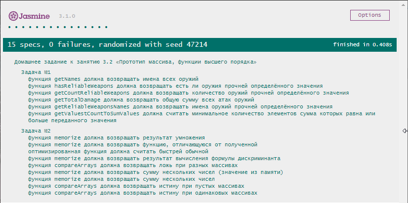

# Домашнее задание к лекции 3.3 «Асинхронность» 

## Задача №1. Будильник-колыбельная

Помогите старому знакомому Васе (он уже студент 1 курса, кстати) перестать просыпать на пары. 
Для этого нужно написать Программу-будильник-колыбельную с возможностью добавления, удаления, запусков и остановки звонков.

## Процесс реализации

1. Необходимо написать класс *AlarmClock* со следующими методами:

* `constructor` - выделяет память для объекта. 
	* Создайте свойство для хранения коллекции звонков `alarmCollection` с начальным значением пустого массива. 
	* Создайте свойство для хранения `id` таймера без начального значения.

* `addClock` - добавляет новый звонок в коллекцию существующих. 
	* Принимает параметр времени в формате `HH:MM` - время, когда должно запуститься действие.
	* Принимает параметр функции-колбека - действие, которое должно запуститься.
	* Принимает параметр идентификатора создаваемого звонка.
	* Проверьте, передан ли параметр `id`. Если параметр не передан, выведите ошибку (с помощью `console.error()`) и завершите выполнение метода.
	* Проверьте, есть ли какой-нибудь звонок с уже существующим `id`. Если есть, выведите ошибку (с помощью `console.error()`) и завершите выполнение метода.
	* Если вы знакомы с темой [исключений в JavaScript](https://developer.mozilla.org/ru/docs/Web/JavaScript/Reference/Statements/throw), то вместо вывода ошибки и завершения метода выполните выброс ошибки (с помощью `throw new Error('error text')`).
	* Перед завершением метода добавьте в массив звонков объект со свойствами `id`, `time`, `callback`.

* `removeClock` - удаляет определённый звонок.
	* Принимает `id` звонка, который следует удалить.
	* Удалите из массива звонков тот, у которого `id` совпадает с текущим. (Например, можно использовать метод `filter`).
	* Верните логическое значение об успешности/провале удаления объекта звонка из общего массива.

* `getCurrentFormattedTime` - возвращает текущее время в строковом формате `HH:MM`.

* `start` - запускает все звонки
	* Создайте функцию проверки (`checkClock`), которая принимает звонок и проверяет: если текущее время совпадает со временем звонка, то вызывайте колбек.
	* Если значение идентификатора текущего таймера отсутствует, то создайте новый интервал.
	* В этом интервале реализуйте функцию, которая будет перебирать все будильники, и для каждого вызывать функцию `checkClock`.
	* Результат функции `setInterval` сохраните в свойстве идентификатора текущего таймера.

* `stop` - останавливает все выполнение звонков
	* Сделайте проверку существования идентификатора текущего таймера.
	* Если у идентификатора текущего таймера есть значение, то вызовите функцию `clearInterval` для удаления интервала, а так же удалите значение из свойства идентификатора текущего таймера.

* `printAlarms` - печатает все звонки
	* С помощью метода `forEach` выведите информацию о каждом звонке (`id` и `time`).

* `clearAlarms` - удаляет все звонки
	* Вызывает метод остановки интервала.
	* Удаляет все звонки.

2. Напишите пример использования класса *AlarmClock* (Реализуйте и запустите функцию `testCase`): 

* Создайте объект класса `AlarmClock`.

* Добавьте в созданный объект новый звонок с текущим временем и колбеком вывода текста на консоль. Так, чтобы после запуска, функция вывода *выполнилась несколько раз*.

* Добавьте ещё один звонок со временем +1 минуты от текущего времени и колбеком: вывода текста на консоль, а так же удалением этого звонка. Так, чтобы после запуска функция вывода *выполнилась один раз, а потом удалилась*.

* Добавьте ещё один звонок со временем +2 минут от текущего времени и колбеком: вывода текста на консоль, а так же остановки всех звонков, очистки всех звонков и выводом всех звонков. Так, чтобы после запуска функция вывода *выполнилась один раз, потом остановился интервал, все звонки очистились, и ничего не вывелось*.

* Напечатайте все звонки (должно вывестись 3 звонка).

* Запустите выполнение ваших звонков.

Результат работы должен быть примерно таким (код выполнялся по командам из консоли):

### Критерии выполнения

1. Старайтесь избегать циклы. Задание можно реализовать без них. Вместо циклов используйте *функции высшего порядка*, изученные ранее.
2. Функция `testCase` может отличаться от описания в задании. Главное показать:
	* Создание объекта звонков;
	* Добавление нескольких звонков;
	* Удаление звонков в зависимости от условия;
	* Печать звонков перед удалением и после (для доказательства того, что звонки действительно добавляются и удаляются);
	* Запуск звонков и **срабатывание в нужное время**;
	* Остановка звонков.

## Требования для выполнения домашней работы

* браузер;
* редактор кода, например [Sublime][1] или [Visual Studio Code][2];
* аккаунт на [GitHub][0] ([инструкция по регистрации на GitHub][3]);
* система контроля версий [Git][4], установленная локально ([инструкция по установке Git][5]);
* запуск всех тестов должен успешно выполнять все тесты:

## Решение задач
1. Перейти в папку задания, например, для первого задания `cd ./3.3-async`.
2. Открыть файл `task.js` в вашем редакторе кода и выполнить задание.
3. Открыть файл `index.html` в вашем браузере и с помощью консоли DevTools убедиться в правильности выводимых результатов.
4. Добавить файл `task.js` в индекс git с помощью команды `git add %file-path%`, где %file-path% - путь до целевого файла, например, для первого задания `git add async/task.js`.
5. Сделать коммит используя команду `git commit -m '%comment%'`, где %comment% - это произвольный комментарий к вашему коммиту, например, для первого задания 'first commit async'.
6. Опубликовать код в репозиторий homeworks с помощью команды `git push -u homeworks master`.
7. Прислать ссылку на репозиторий через личный кабинет на сайте [Нетологии][6].

[0]: https://github.com/
[1]: https://www.sublimetext.com/
[2]: https://code.visualstudio.com/
[3]: https://github.com/netology-code/guides/blob/master/git/github.md
[4]: https://git-scm.com/
[5]: https://github.com/netology-code/guides/blob/master/git/REAMDE.md
[6]: https://netology.ru/

*Никаких файлов прикреплять не нужно.*

Все задачи обязательны к выполнению для получения зачета. Присылать на проверку можно каждую задачу по отдельности или все задачи вместе. Во время проверки по частям ваша домашняя работа будет со статусом "На доработке".

Любые вопросы по решению задач задавайте в Slack-канале.
